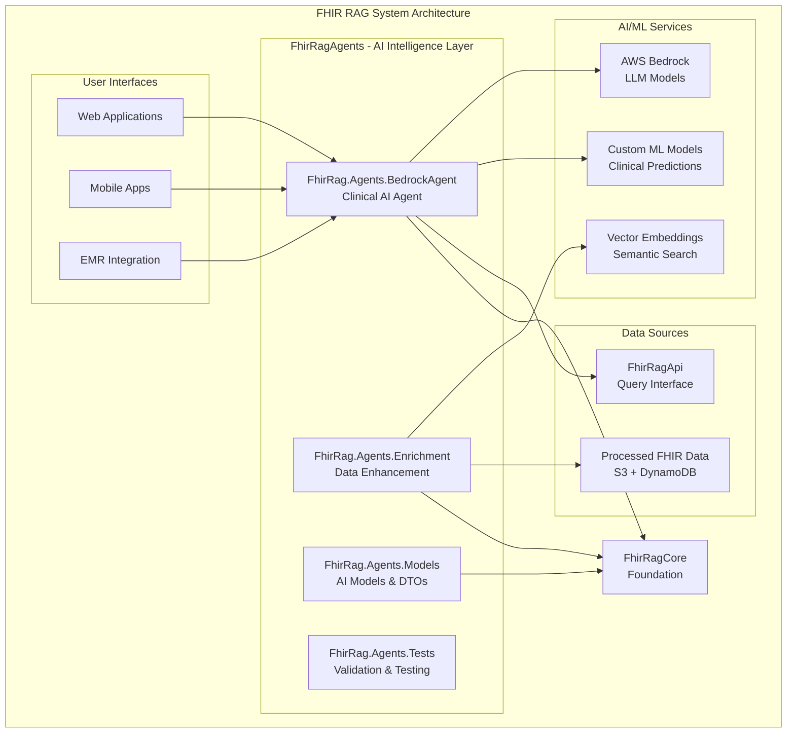
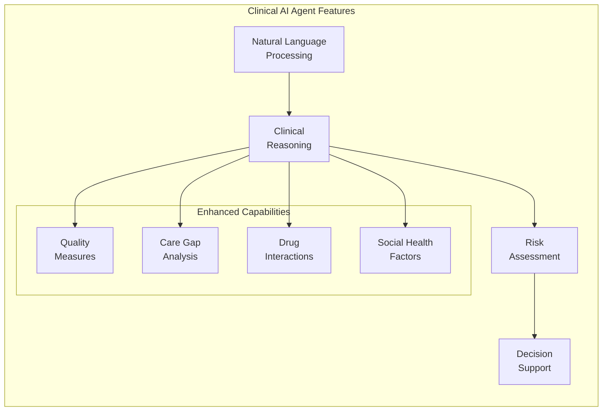

# FhirRag AI Agents

## 🎯 Solution Overview

The **FhirRagAgents** solution provides intelligent AI-powered agents for clinical decision support, FHIR resource enrichment, and advanced healthcare analytics. This solution leverages AWS Bedrock and other AI services to create context-aware, clinically-informed responses that enhance healthcare workflows and decision-making processes.

## 🏗️ Architecture Role



## 📦 Projects

### FhirRag.Agents.BedrockAgent
**AWS Lambda-based clinical AI agent using AWS Bedrock**

- **Purpose**: Primary AI agent for clinical decision support and natural language queries
- **Runtime**: .NET 8.0 on AWS Lambda
- **Key Features**:
  - Natural language processing for clinical queries
  - Context-aware responses using FHIR data
  - Multi-modal input support (text, images, structured data)
  - Clinical reasoning and explanation generation
  - Risk assessment and alert generation
  - Personalized recommendations based on patient history

### FhirRag.Agents.Enrichment
**AI-powered FHIR resource enhancement service**

- **Purpose**: Intelligently enhance FHIR resources with derived insights and clinical context
- **Key Features**:
  - Clinical terminology normalization and mapping
  - Disease progression modeling
  - Drug interaction analysis
  - Care gap identification
  - Quality measure calculation
  - Social determinants of health inference

### FhirRag.Agents.Models
**Shared data models and DTOs for AI agents**

- **Purpose**: Common data structures and models used across all AI agent components
- **Key Components**:
  - AI request/response models
  - Clinical insight structures
  - ML model input/output DTOs
  - Agent configuration models
  - Performance metrics models

### FhirRag.Agents.Tests
**Comprehensive testing suite for AI agents**

- **Purpose**: Ensure reliability, accuracy, and safety of AI-powered clinical tools
- **Key Features**:
  - Clinical scenario validation
  - AI response quality assessment
  - Bias detection and fairness testing
  - Performance benchmarking
  - Safety and hallucination detection

## 🔗 Core Agent Capabilities



## 🧠 AI Agent Interfaces

### Primary Agent Interface
```csharp
public interface IClinicalAgent
{
    Task<ClinicalResponse> ProcessQueryAsync(
        ClinicalQuery query, 
        PatientContext context, 
        CancellationToken cancellationToken = default);
    
    Task<List<ClinicalInsight>> GenerateInsightsAsync(
        FhirPatient patient, 
        ClinicalContext context,
        CancellationToken cancellationToken = default);
    
    Task<RiskAssessment> AssessRiskAsync(
        PatientData patientData,
        RiskFactors riskFactors,
        CancellationToken cancellationToken = default);
}

// Clinical query model
public class ClinicalQuery
{
    public string QueryText { get; set; }
    public QueryType Type { get; set; }
    public string PatientId { get; set; }
    public string TenantId { get; set; }
    public Dictionary<string, object> Context { get; set; }
    public QueryPriority Priority { get; set; }
}

// Response model
public class ClinicalResponse
{
    public string ResponseId { get; set; }
    public string Response { get; set; }
    public double ConfidenceScore { get; set; }
    public List<ClinicalReference> Sources { get; set; }
    public List<string> Warnings { get; set; }
    public ResponseMetadata Metadata { get; set; }
}
```

### Enrichment Interface
```csharp
public interface IEnrichmentAgent
{
    Task<EnrichmentResult> EnrichPatientAsync(
        FhirPatient patient,
        EnrichmentOptions options,
        CancellationToken cancellationToken = default);
    
    Task<List<CareGap>> IdentifyCareGapsAsync(
        FhirPatient patient,
        ClinicalGuidelines guidelines,
        CancellationToken cancellationToken = default);
    
    Task<QualityMeasures> CalculateQualityMeasuresAsync(
        FhirPatient patient,
        MeasureSet measures,
        CancellationToken cancellationToken = default);
}
```

## 🔄 Dependencies

### Internal Dependencies
- **FhirRagCore**: Foundation libraries (domain models, security, telemetry)
- **FhirRagApi**: Data access for patient and clinical information

### External Dependencies
- **AWS Bedrock SDK**: LLM model access and management
- **AWS Lambda Runtime**: Serverless execution environment
- **ML.NET**: Custom machine learning model execution
- **Newtonsoft.Json**: JSON processing for AI model I/O
- **Microsoft.Extensions.AI**: AI abstraction framework

### AI/ML Services
- **AWS Bedrock Models**: Claude, Titan, Cohere models
- **Custom ML Models**: Deployed on SageMaker or Lambda
- **Vector Databases**: For similarity search and RAG
- **Clinical NLP Services**: Medical terminology processing

## 🚀 Deployment Instructions

### Prerequisites
- AWS CLI with Bedrock access permissions
- .NET 8.0 SDK
- AWS Lambda Tools for .NET

### Agent Deployment
```bash
# Navigate to solution directory
cd solutions/FhirRagAgents

# Build all projects
dotnet build --configuration Release

# Deploy Bedrock Agent
cd FhirRag.Agents.BedrockAgent/src/FhirRag.Agents.BedrockAgent
dotnet lambda deploy-function --profile your-aws-profile

# Configure Bedrock model access
aws bedrock list-foundation-models --region us-east-1
```

### Model Configuration
```bash
# Set up Bedrock model permissions
aws iam attach-role-policy \
  --role-name FhirRag-Lambda-Execution-Role \
  --policy-arn arn:aws:iam::aws:policy/AmazonBedrockFullAccess

# Configure custom model endpoints
aws sagemaker create-endpoint-config \
  --endpoint-config-name fhir-rag-clinical-model \
  --production-variants file://model-config.json
```

## ⚙️ Configuration

### Agent Configuration
```json
{
  "BedrockAgent": {
    "ModelConfiguration": {
      "PrimaryModel": "anthropic.claude-3-sonnet-20240229-v1:0",
      "FallbackModel": "anthropic.claude-instant-v1",
      "MaxTokens": 4096,
      "Temperature": 0.1,
      "TopP": 0.9
    },
    "ClinicalContext": {
      "EnableMedicalTerminology": true,
      "IncludeClinicalGuidelines": true,
      "UsePatientHistory": true,
      "MaxContextTokens": 8192
    },
    "Safety": {
      "EnableContentFiltering": true,
      "HallucinationDetection": true,
      "BiasMonitoring": true,
      "ClinicalAccuracyCheck": true
    }
  },
  "Enrichment": {
    "QualityMeasures": {
      "EnableHEDIS": true,
      "EnableCQM": true,
      "EnableCustomMeasures": true
    },
    "CareGaps": {
      "Guidelines": ["AHA", "ADA", "USPSTF"],
      "LookbackPeriodMonths": 24,
      "RiskThreshold": 0.7
    }
  }
}
```

### Environment Variables
```bash
# AWS Bedrock Configuration
AWS_BEDROCK_REGION=us-east-1
BEDROCK_MODEL_ID=anthropic.claude-3-sonnet-20240229-v1:0
BEDROCK_ROLE_ARN=arn:aws:iam::account:role/BedrockExecutionRole

# Clinical AI Settings
CLINICAL_AI_CONFIDENCE_THRESHOLD=0.8
ENABLE_MEDICAL_TERMINOLOGY=true
MAX_CONTEXT_TOKENS=8192

# Safety and Compliance
ENABLE_HALLUCINATION_DETECTION=true
ENABLE_BIAS_MONITORING=true
CLINICAL_ACCURACY_THRESHOLD=0.95

# Performance Settings
MAX_CONCURRENT_REQUESTS=50
REQUEST_TIMEOUT_SECONDS=30
CACHE_TTL_MINUTES=60
```

## 🧪 Testing Strategy

### AI Agent Testing Framework
```bash
# Run comprehensive agent tests
dotnet test --configuration Release

# Run clinical accuracy tests
dotnet test --configuration Release --filter Category=ClinicalAccuracy

# Run bias detection tests  
dotnet test --configuration Release --filter Category=BiasDetection

# Run performance benchmarks
dotnet test --configuration Release --filter Category=Performance
```

### Clinical Validation Tests
```csharp
[TestMethod]
[TestCategory("ClinicalAccuracy")]
public async Task BedrockAgent_ShouldProvideAccurateDiabetesManagement()
{
    // Arrange
    var patient = CreateDiabeticPatient();
    var query = new ClinicalQuery
    {
        QueryText = "What are the current care gaps for this diabetic patient?",
        PatientId = patient.Id,
        Type = QueryType.CareGapAnalysis
    };

    // Act
    var response = await _clinicalAgent.ProcessQueryAsync(query, patient.ToContext());

    // Assert
    Assert.IsTrue(response.ConfidenceScore > 0.9);
    Assert.IsTrue(response.Response.Contains("HbA1c"));
    Assert.IsTrue(response.Sources.Any(s => s.GuidelineType == "ADA"));
}
```

### Bias and Fairness Testing
```csharp
[TestMethod]
[TestCategory("BiasDetection")]
public async Task EnrichmentAgent_ShouldNotShowRacialBias()
{
    // Test patients with identical clinical profiles but different demographics
    var patients = CreateDiversePatientCohort();
    var enrichmentResults = new List<EnrichmentResult>();

    foreach (var patient in patients)
    {
        var result = await _enrichmentAgent.EnrichPatientAsync(patient, standardOptions);
        enrichmentResults.Add(result);
    }

    // Assert no significant variance in care recommendations based on demographics
    var riskScoreVariance = CalculateVariance(enrichmentResults.Select(r => r.RiskScore));
    Assert.IsTrue(riskScoreVariance < 0.05, "Risk scores should not vary significantly by demographics");
}
```

## 🔒 Safety & Compliance

### Clinical Safety Measures
- **Hallucination Detection**: ML models trained to identify potentially harmful AI-generated medical advice
- **Confidence Scoring**: All responses include confidence levels with minimum thresholds for clinical recommendations
- **Source Attribution**: All clinical insights linked to peer-reviewed sources and guidelines
- **Human-in-the-Loop**: Critical decisions require human review and approval

### Regulatory Compliance
- **FDA Guidelines**: Following FDA guidance for AI/ML-based medical devices
- **HIPAA Compliance**: All patient data processing maintains HIPAA requirements
- **Clinical Guidelines**: Adherence to AMA, AHA, ADA, and other clinical standards
- **Audit Trails**: Complete tracking of AI decision processes for regulatory review

### Bias Mitigation
```csharp
public class BiasMitigationService
{
    public async Task<BiasAssessment> AssessResponseBiasAsync(
        ClinicalResponse response,
        PatientDemographics demographics)
    {
        // Check for demographic-based variations in recommendations
        var historicalResponses = await GetSimilarClinicalResponsesAsync(response.QueryType);
        var biasMetrics = CalculateBiasMetrics(response, historicalResponses, demographics);
        
        return new BiasAssessment
        {
            BiasScore = biasMetrics.OverallBiasScore,
            DemographicVariations = biasMetrics.DemographicVariations,
            Recommendations = GenerateBiasMitigationRecommendations(biasMetrics)
        };
    }
}
```

## 📊 Performance & Monitoring

### Performance Characteristics
- **Response Time**: < 5 seconds for standard clinical queries
- **Throughput**: 100+ concurrent clinical consultations
- **Accuracy**: > 95% clinical guideline adherence
- **Availability**: 99.9% uptime with multi-region deployment

### AI Model Monitoring
```bash
# Key metrics to monitor
- Model inference latency
- Confidence score distributions
- Clinical accuracy rates
- Bias detection alerts
- Hallucination detection events
- Patient safety incidents

# CloudWatch custom metrics
aws cloudwatch put-metric-data \
  --namespace "FhirRag/Agents" \
  --metric-data MetricName=ClinicalAccuracy,Value=0.97,Unit=Percent
```

### Quality Assurance Dashboard
- Real-time accuracy monitoring
- Bias detection alerts
- Clinical guideline compliance tracking
- Patient safety incident reporting
- Model performance degradation detection

## 🎯 Clinical Use Cases

### 1. Clinical Decision Support
```csharp
// Example: Medication interaction checking
var query = new ClinicalQuery
{
    QueryText = "Are there any dangerous interactions between this patient's current medications?",
    PatientId = "patient-123",
    Type = QueryType.DrugInteractionCheck
};

var response = await bedrockAgent.ProcessQueryAsync(query, patientContext);
// Returns: Interaction analysis with severity levels and recommendations
```

### 2. Care Gap Identification
```csharp
// Example: Preventive care recommendations
var careGaps = await enrichmentAgent.IdentifyCareGapsAsync(
    patient: diabeticPatient,
    guidelines: ClinicalGuidelines.ADA_2024
);
// Returns: Missing screenings, overdue tests, preventive measures
```

### 3. Risk Stratification
```csharp
// Example: Cardiovascular risk assessment
var riskAssessment = await bedrockAgent.AssessRiskAsync(
    patientData: patientWithHeartDisease,
    riskFactors: CardiovascularRiskFactors.Standard
);
// Returns: 10-year cardiovascular event probability with interventions
```

## 🔧 Integration Examples

### Web Application Integration
```csharp
// Controller for clinical AI queries
[ApiController]
[Route("api/clinical-ai")]
public class ClinicalAIController : ControllerBase
{
    private readonly IClinicalAgent _clinicalAgent;
    
    [HttpPost("query")]
    public async Task<IActionResult> ProcessClinicalQuery([FromBody] ClinicalQueryRequest request)
    {
        var securityContext = GetSecurityContext();
        
        if (!securityContext.HasPermission("clinical.ai.query"))
            return Forbid();
            
        var query = new ClinicalQuery
        {
            QueryText = request.Query,
            PatientId = request.PatientId,
            TenantId = securityContext.TenantId
        };
        
        var response = await _clinicalAgent.ProcessQueryAsync(query, patientContext);
        return Ok(response);
    }
}
```

### EMR Integration
```csharp
// FHIR R4 compliant integration
public class FhirClinicalAIService
{
    public async Task<Bundle> GetAIInsightsForPatient(string patientId)
    {
        var patient = await _fhirClient.ReadAsync<Patient>($"Patient/{patientId}");
        var insights = await _clinicalAgent.GenerateInsightsAsync(patient.ToFhirPatient());
        
        return CreateInsightsBundle(insights);
    }
    
    private Bundle CreateInsightsBundle(List<ClinicalInsight> insights)
    {
        var bundle = new Bundle { Type = Bundle.BundleType.Collection };
        
        foreach (var insight in insights)
        {
            var observation = new Observation
            {
                Status = ObservationStatus.Final,
                Code = insight.ToCodeableConcept(),
                Value = insight.ToQuantity(),
                Note = new List<Annotation> { new Annotation { Text = insight.Description } }
            };
            
            bundle.Entry.Add(new Bundle.EntryComponent { Resource = observation });
        }
        
        return bundle;
    }
}
```

## 🚨 Troubleshooting

### Common Issues

1. **Bedrock Model Access Denied**
   ```bash
   # Check IAM permissions
   aws iam list-attached-role-policies --role-name FhirRag-Lambda-Execution-Role
   
   # Enable Bedrock model access
   aws bedrock get-foundation-model --model-identifier anthropic.claude-3-sonnet-20240229-v1:0
   ```

2. **High Latency Responses**
   ```bash
   # Monitor Lambda performance
   aws logs filter-log-events \
     --log-group-name /aws/lambda/FhirRag-Agents-BedrockAgent \
     --filter-pattern "REPORT RequestId"
   ```

3. **Clinical Accuracy Issues**
   ```bash
   # Review clinical validation metrics
   aws cloudwatch get-metric-statistics \
     --namespace "FhirRag/Agents" \
     --metric-name ClinicalAccuracy \
     --start-time 2023-12-01T00:00:00Z \
     --end-time 2023-12-02T00:00:00Z \
     --period 3600 \
     --statistics Average
   ```

---

**🧠 Empowering Healthcare with Responsible AI - Accurate, Safe, Ethical**